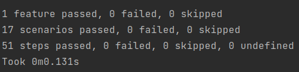

# КонсультантПлюс. Тестовое задание

В этом проекте реализованы 2 задачи:
1) Написано консольное приложение, ищущее в текстовом файле пару заданных слов
   на определённом расстоянии друг от друга
2) Написаны тесты для этого приложения с помощью фреймворка Behave

## Запуск приложения

Всего есть 2 способа запуска приложения

Файл ```count_pairs.exe``` - основной способ (реализация через ```CharParser.h```), ```count_pairs_2.exe``` - второй способ (реализация через ```StringParser.h```). Подробнее о способах можно прочитать ниже

Пример запуска приложения из корневой директории:
```
./count_pairs.exe file_path word_1 word_2 max_distance 
```
* ```file_path``` - путь к текстовому файлу
* ```word_1``` - первое слово
* ```word_2``` - первое слово
* ```max_distance``` - максимальное расстояние между ними

Можно запустить приложение на тестовом файле ``` input.txt ```

### Сборка и запуск тестов

Для запуска тестов на Behave необходимо настроить виртуальное окружение.
После того, как мы его активировали, установим зависимости:
```
pip install -r requirements.txt 
```

Далее находим путь к файлу ```count_pairs.feature``` и вводим в командной строке:
```
behave feature_file_path
```

Конец вывода должен быть таким:



## Структура проекта

```
      .
      ├── features                        
      │     ├── steps  
      │     │     └── steps.py               # Запускает тесты
      │     └── count_pairs.feature          # Содержит тесты на человеческом языке
      │    
      ├── Parsers                            # Содержит классы парсеров
      │     ├── Parser.h
      │     ├── CharParser.h                 # Используем по умолчанию
      │     └── StringParser.h
      │    
      ├── count_pairs.exe                    # Используем по умолчанию
      ├── count_pairs_2.exe
      │    
      ├── input.txt                          # Тестовый файл
      ├── requirements.txt
      │    
      ├── main.cpp
      ├── Parser.cpp
      ├── CharParser.cpp
      └── StringParser.cpp
```

## Парсеры

В абстрактном классе ```Parser.h``` представлены 3 словаря:


* ```regChar```: Множество символов, которые нужно игнорировать. Все они занимают 1 байт
* ```regStr```: Ключи - строки, которые нужно игнорировать. Значения - сколько байт занимает строка. Необходимость этого словаря в том, что не все символы помещаются в char
* ```regNoSkip```: Ключи - символы, которые **не нужно** игнорировать. Значения - сколько байт занимает символ. Например в слове ```демо-урока``` не нужно игногрировать ```-```

_Символы, не входящие в ```regChar``` и в ```regStr``` будут восприниматься как слова. Исходный текстовый файл должен быть обработан или же нужно передать список всех возможный символов в множество_

**Две реализации парсера: ```StringParser.h``` и ```CharParser.h```. Вызываются из ```main.cpp```**


## Логика приложения/алогритма

* Порядок первого и второго слова важен. Т.е. в предложении ```Весна пришла! Весна пришла!``` запрос ```Весна пришла 0``` вернет 2 пары. Пара ```пришла! Весна``` не считается
* Слова, пищущиеся через дефис не разделяются. Например ```демо-урока``` считается за одно слово
* Символы такие как ```, . : ; № # ``` и т.д., встречающиеся вначале или в конце строки игнорируются. Слово ```!перерыв&``` считается как ```перерыв``` 
* Слова на английском также считаются


## Алгоритм приложения

Задача написания приложения делится на 2 подзадачи:
* Найти самый быстрый способ чтения файла
* Придумать алгоритм поиска пар на расстоянии меньшем или равным чем заданное 
  
  
### Чтение файла и поиск слов

#### 1) Первый способ

Читаем файл по словам. Далее каждое слово форматируем и избавляемся от таких знаков, как `````, . : ; № #````` и т.д.

Далее представлена диаграмма обработки и сравнения слов


#### 2) Второй способ

Отображаем файл в память с помощью ```mmap``` и читаем его образ посимвольно. Далее каждое слово форматируем, избавляясь от знаков, таких как ```',' '.' ':' ';' '№'``` и т.д.

Алгоритм сравнения и обработки строк такой же, как и в первом способе. Только за счет, того, что мы работаем с массивом ```char```, получается немного быстрее


**Сравнение производительности**

Для совсем маленьких файлов второй способ медленнее первого, но для больших файлов, он быстрее примерно в 1,5 раза.
Предполагаю, что реальные файлы для поиска будут большими, поэтому при вызове программы будет использоваться второй способ


